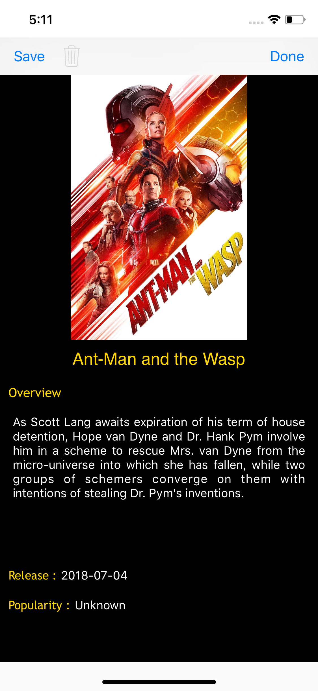

# Movie Database Application
## Description
Movie Database Application is an iOS mobile application that allows user to search for movies in [The Movie Database](https://developers.themoviedb.org/3/getting-started/introduction) and displays results in a simple and neat UI. The application uses [TheMovieDatabaseSwiftWrapper](https://github.com/gkye/TheMovieDatabaseSwiftWrapper) to fetch response from the Movie Database API.

## Features

### Top Movies & Upcoming Movies
- Top movies and upcoming movies, both of them are displayed in a 2-column fashion.
- A search bar is provided to narrow down the results displayed. Care is taken to ensure search results are optimized without any lag.

  | Top Movies                                                 | Upcoming Movies                                            |
  |------------------------------------------------------------|------------------------------------------------------------|
  |         |    |

### Search Movies
- The view provides results by two ways:
  1) Auto search results are displayed at the text field as the user enters the letters.
  2) When user clicks the search button i.e the magnifying glass, the results are neatly displayed in a table view.
  
  
## Detail View
The view shows details of the selected movie.
 
