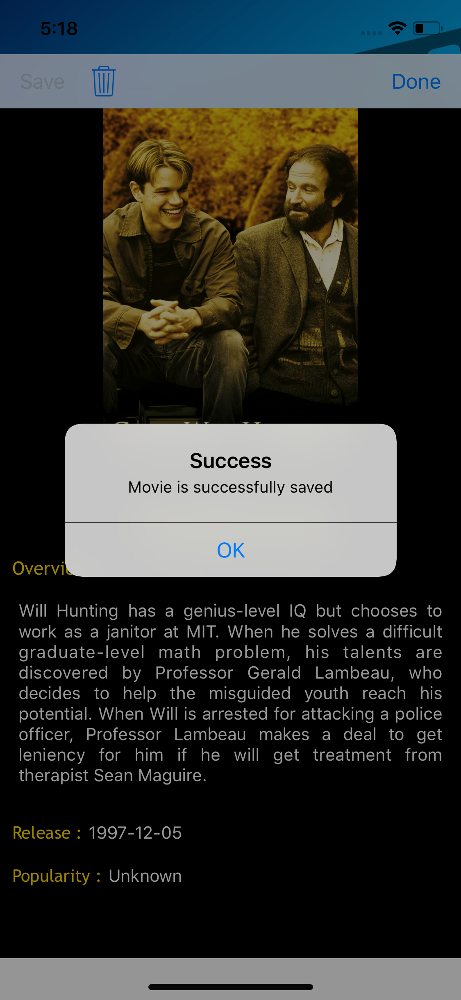
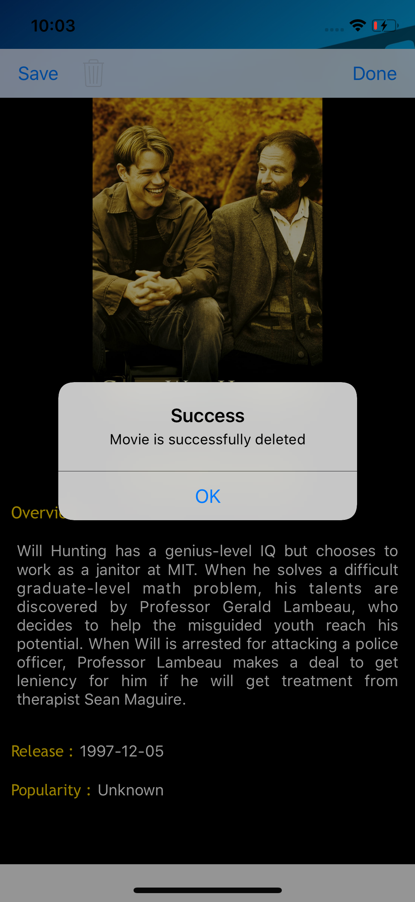

# Movie Database Application
## Description
Movie Database Application is an iOS mobile application that allows user to search for movies from [The Movie Database](https://developers.themoviedb.org/3/getting-started/introduction) and displays results in a simple and neat UI. The application uses [TheMovieDatabaseSwiftWrapper](https://github.com/gkye/TheMovieDatabaseSwiftWrapper) to fetch responses from the Movie Database API.

## Features

### Top Movies & Upcoming Movies
- Top movies and upcoming movies, both of them are displayed in a 2-column fashion.
- A search bar is provided to narrow down the results displayed. Care is taken to ensure search results are optimized without any lag.

  | Top Movies                                                 | Upcoming Movies                                            |
  |------------------------------------------------------------|------------------------------------------------------------|
  |         |    |

#
### Search Movies
- The view provides results by two ways:
  1) Auto search results are displayed at the text field as the user enters the letters.
  2) When user clicks the search button i.e the magnifying glass, the results are neatly displayed in a table view.

| Search                                        |  Textfield Results                            | Table View Results     |
|-----------------------------------------------|-----------------------------------------------|------------------------|
|||| 
 
#  
### Save and Delete
- The view shows details of the selected movie.
- The movie can be saved to the database to help user check the information of the movie without network. The saved movie can also be deleted.
- Movies are saved and deleted using [Realm](https://realm.io/docs/swift/latest/) database.

Details                                          | Save Movies                                  | Delete Movies              |
-------------------------------------------------|----------------------------------------------|----------------------------|
| | |

### Handle Network Loss
- Top movies and upcoming movies from the last displayed list are saved in the background.
- The same list of movies is displayed when there are network connectivity issues.

#
## How to build
1. Clone the repository
```bash
$ git clone https://github.com/rahul-racha/movie-db.git
```
2. Install pods
```bash
$ cd movie-db
$ pod install
```
3. Open the workspace in Xcode
```bash
$ open homes-movie-db.xcworkspace -a Xcode
```

## Requirements

* Xcode 9
* iOS 10+
* Swift 4

